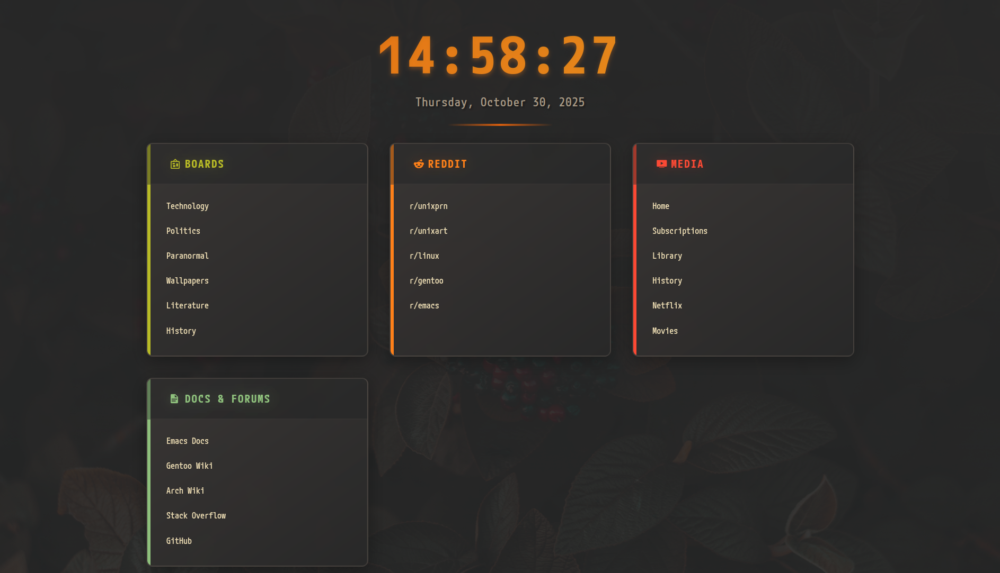

<div align="center">

# 🍂 Gruvbox Fall Startpage

*A lightweight, cozy browser startpage with premium Gruvbox aesthetics*

[](https://user7210unix.github.io/Home/)
[](LICENSE)
[](https://github.com/morhetz/gruvbox)



[🚀 Live Demo](https://user7210unix.github.io/Home/) • [📖 Documentation](#-features) • [⚡ Quick Start](#-quick-start) • [🎨 Customization](#-customization)

</div>

---

## 📋 Overview

A meticulously crafted browser startpage that combines the beloved **Gruvbox Dark** color scheme with fall aesthetics. Featuring premium animations, keyboard-driven navigation, and a powerful search system with custom prefixes—all wrapped in a lightweight, performant package.

Perfect for r/unixporn enthusiasts, minimalists, and anyone who appreciates thoughtful design. 🎯

## ✨ Features

### 🎨 **Premium Design**
- **Gruvbox Dark Theme** - Warm, retro color palette inspired by the iconic Gruvbox
- **Fall Aesthetics** - Cozy background with subtle fade-in animation
- **Color-Coded Categories** - Each section has unique accent colors with glowing effects
- **Thick Accent Borders** - Bold 6-8px left borders that expand on hover
- **Smooth Animations** - Cubic-bezier transitions and hover effects throughout

### ⌨️ **Keyboard-Driven**
- **Spacebar** → Open search overlay instantly
- **Escape** → Close search and return to startpage
- **Enter** → Execute search with smart prefix detection
- No mouse required for core functionality

### 🔍 **Smart Search System**
Built-in search prefixes for instant navigation:

| Prefix | Target | Example |
|--------|--------|---------|
| `yt:` | YouTube | `yt: linux rice tutorial` |
| `gh:` | GitHub | `gh: neovim plugins` |
| `aw:` | Arch Wiki | `aw: pacman` |
| `gw:` | Gentoo Wiki | `gw: portage` |
| `r:` | Reddit | `r: unixporn` or `r: /r/linux` |
| `4:` | 4chan Board | `4: g` → /g/ board |
| *(none)* | Google | `gruvbox colorscheme` |

### 🔗 **Curated Quick Links**
- **4chan** - /g/, /pol/, /x/, /wg/, /lit/, /out/
- **Reddit** - r/unixporn, r/unixart, r/linux, r/archlinux, r/emacs, r/cozy
- **YouTube** - Home, Subscriptions, Library, History, Watch Later
- **Docs & Forums** - Emacs Docs, Gentoo Wiki, Arch Wiki, Stack Overflow, GitHub

### 🦊 **Firefox Compatible**
- Bypasses Firefox's startpage link restrictions
- Works with custom CSS themes (e.g., Gruvbox Firefox themes)
- Fully functional in `about:home` and `about:newtab`

### ⚡ **Performance**
- **Lightweight** - Pure HTML/CSS/JS, no frameworks
- **Fast Load** - Minimal dependencies, optimized assets
- **Smooth** - 60fps animations with GPU acceleration
- **Responsive** - Works on all screen sizes

## 🚀 Quick Start

### Option 1: Use Live Version
Simply set your browser homepage to:
```
https://user7210unix.github.io/Home/
```

### Option 2: Local Installation

```bash
# Clone the repository
git clone https://github.com/user7210unix/Home.git
cd Home

# Open in browser
firefox index.html
# or
chromium index.html
```

### Set as Firefox Homepage

**Method 1: Settings**
1. Open Firefox Settings → Home
2. Set Homepage to: `file:///path/to/Home/index.html`
3. Enjoy!

**Method 2: about:config**
1. Navigate to `about:config`
2. Search for `browser.startup.homepage`
3. Set value to: `file:///path/to/Home/index.html`

## 📁 Project Structure

```
Home/
├── index.html                    # Main page
├── assets/
│   └── static/
│       ├── fonts/               # M PLUS Code Latin + JetBrainsMono Nerd Font
│       │   ├── JetBrainsMonoNerdFont-*.ttf
│       │   └── MPLUSCodeLatin-*.ttf
│       └── Images/
│           └── bg.jpg           # Fall background image
├── css/
│   └── styles.css              # All styling (Gruvbox colors + animations)
├── js/
│   └── script.js               # Clock, search, navigation logic
└── README.md
```

## 🎨 Customization

### Change Colors

Edit `css/styles.css` and modify the CSS variables:

```css
:root {
    --bg: #282828;              /* Main background */
    --bg-alt: #3c3836;          /* Secondary background */
    --fg: #ebdbb2;              /* Text color */
    --autumn-orange: #d65d0e;   /* Primary accent */
    --autumn-yellow: #d79921;   /* Secondary accent */
    --autumn-red: #cc241d;      /* Tertiary accent */
    /* ... more colors ... */
}
```

### Adjust Background Opacity

In `css/styles.css`, find the `@keyframes fadeIn`:

```css
@keyframes fadeIn {
    to {
        opacity: 0.2;  /* Change value (0.0 = invisible, 1.0 = opaque) */
    }
}
```

### Add/Remove Links

Edit `index.html` to modify link categories:

```html
<div class="link-category">
    <h2><span class="icon">🔥</span> Your Category</h2>
    <div class="links">
        <a href="#" data-href="https://example.com">Your Link</a>
    </div>
</div>
```

### Add Search Prefixes

Edit `js/script.js` in the `handleSearch()` function:

```javascript
if (query.startsWith('tw:')) {
    // Twitter search
    const searchTerm = query.substring(3).trim();
    url = `https://twitter.com/search?q=${encodeURIComponent(searchTerm)}`;
}
```

## 🛠️ Tech Stack

- **HTML5** - Semantic markup
- **CSS3** - Modern features (Grid, Flexbox, Custom Properties, Animations)
- **Vanilla JavaScript** - No dependencies, pure ES6+
- **Fonts** - M PLUS Code Latin, JetBrainsMono Nerd Font

## 🎯 Design Philosophy

This startpage follows three core principles:

1. **Functionality First** - Every feature serves a purpose
2. **Aesthetic Excellence** - Beautiful design that respects the Gruvbox heritage
3. **Performance Matters** - Fast, smooth, responsive

## 🤝 Contributing

Contributions are welcome! Feel free to:

- 🐛 Report bugs
- 💡 Suggest features
- 🎨 Submit design improvements
- 📝 Improve documentation

## 📜 License

This project is open source and available under the MIT License.

## 🙏 Credits

- **Color Scheme** - [Gruvbox](https://github.com/morhetz/gruvbox) by morhetz
- **Fonts** - [M PLUS Code Latin](https://fonts.google.com/specimen/M+PLUS+Code+Latin) & [JetBrainsMono Nerd Font](https://www.nerdfonts.com/)
- **Icons** - Nerd Fonts symbol glyphs
- **Inspiration** - r/unixporn, r/startpages communities

---

<div align="center">

**[⬆ Back to Top](#-gruvbox-fall-startpage)**

Made with 🍂 and ☕ by [user7210unix](https://github.com/user7210unix)

*If you found this useful, consider giving it a ⭐!*

</div>
